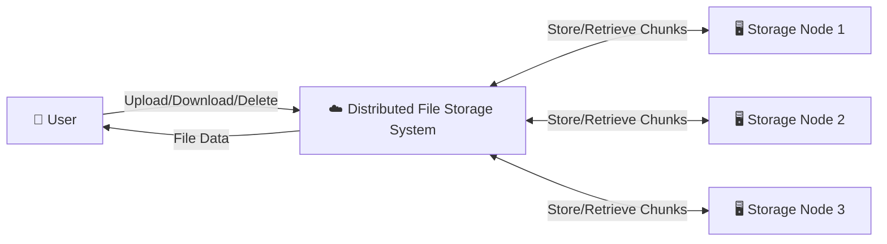
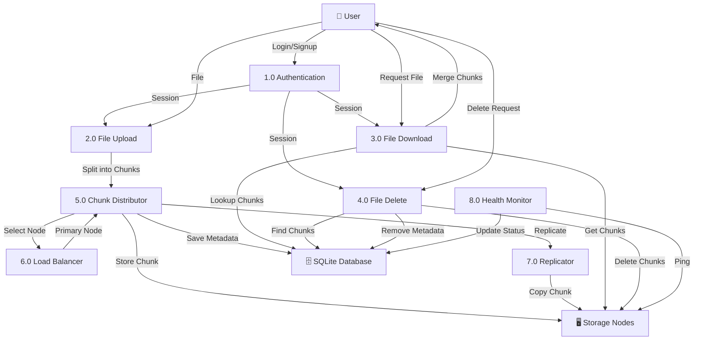
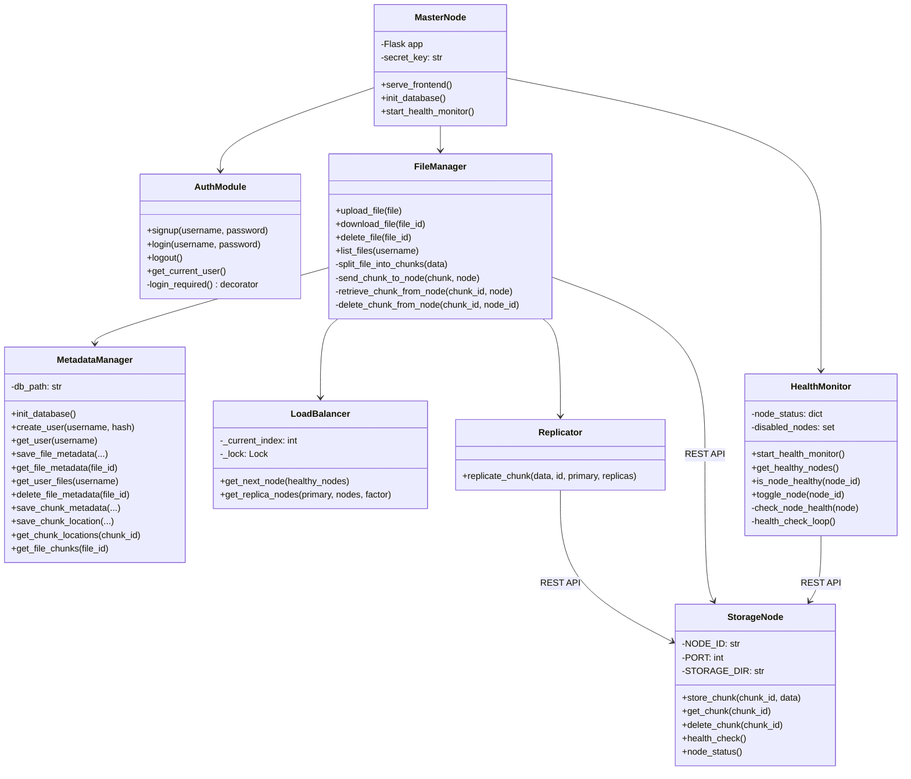
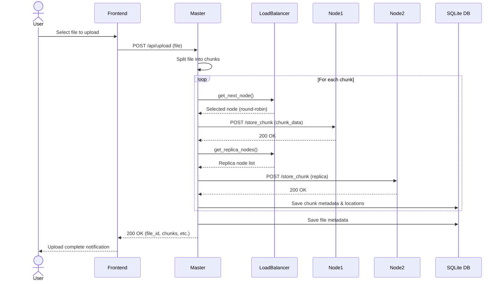
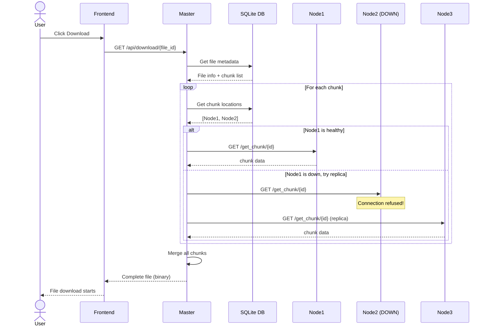
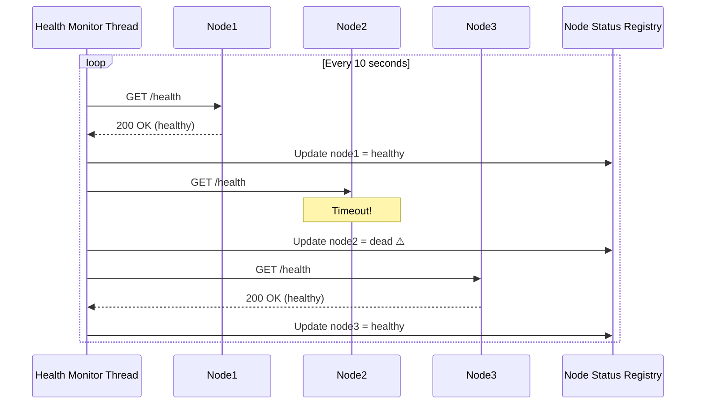

# Diagrams — Distributed File Storage System

## 1. DFD Level 0 (Context Diagram)

**Description:**  
The user interacts with the Distributed File Storage System to upload, download, and delete files. Internally, the system distributes file chunks across multiple storage nodes.

---

## 2. DFD Level 1 (Detailed)

---

## 3. Class Diagram

---

## 4. Sequence Diagram — File Upload

---

## 5. Sequence Diagram — File Download (with Fault Tolerance)

---

## 6. Sequence Diagram — Health Monitoring

